# Clustering Methods

This folder contains clustering algorithms for grouping archaeological objects by spatial proximity. All methods follow the same interface so they can be swapped in the plugin without changing any other code.

## Table of Contents

1. [Available Methods](#available-methods)
2. [Interface Specification](#interface-specification)
3. [Adding a New Method](#adding-a-new-clustering-method)
4. [Barnes-Hut Clustering (detailed)](#barnes-hut-clustering)
   - [Overview](#overview)
   - [Algorithm Steps](#algorithm-steps)
   - [Quality Gate and Proximity Merge](#quality-gate-and-proximity-merge)
   - [Parameters](#parameters)
   - [DEM Integration](#dem-integration)
   - [Process Diagram](#process-diagram)
   - [Complexity](#complexity)
5. [File Structure](#file-structure)
6. [Usage in QGIS](#usage-in-qgis)

---

## Available Methods

| Key | Class | Description | Dependencies |
|-----|-------|-------------|-------------|
| `dbscan` | `DBSCANClustering` | Density-Based Spatial Clustering of Applications with Noise | sklearn |
| `kmeans` | `KMeansClustering` | K-Means clustering | sklearn |
| `aglomerative` | `AglomerativeClustering` | Agglomerative (hierarchical) clustering | sklearn |
| `grid` | `GridClustering` | Grid-based spatial binning | numpy only |
| `barnes_hut` | `BarnesHutClustering` | Adaptive quadtree clustering with optional topographic check and silhouette quality gate | numpy, sklearn (optional) |

All methods are registered in `__init__.py` via the `AVAILABLE_METHODS` dictionary.

---

## Interface Specification

All clustering methods must:

1. Inherit from `BaseClusteringMethod` (defined in `base_clustering.py`)
2. Set `self.name` and `self.description` in `__init__()`
3. Implement `cluster(object_centroids, distance_threshold=100.0)` returning a list of integer labels

### Input Format

`object_centroids` is a list of tuples, each containing:

| Index | Field | Type | Description |
|-------|-------|------|-------------|
| 0 | `lat` | float | Latitude of object centroid |
| 1 | `lon` | float | Longitude of object centroid |
| 2 | `obj_points` | list of QgsPointXY | Original map points |
| 3 | `obj_transformed` | list of QgsPointXY | Transformed points (EPSG:4326) |
| 4 | `azimuth_or_none` | float or None | Optional azimuth value |

### Output Format

A list of integers, one per object, indicating cluster membership:

- Objects in the same cluster share the same label
- Labels start from 0 and are consecutive (no gaps)
- Example: `[0, 0, 0, 1, 1]` — objects 0, 1, 2 in cluster 0; objects 3, 4 in cluster 1

---

## Adding a New Clustering Method

1. Create a new file (e.g., `my_method_clustering.py`) in this folder
2. Inherit from `BaseClusteringMethod` and implement `cluster()`
3. Register it in `__init__.py`:

```python
from .my_method_clustering import MyMethodClustering

AVAILABLE_METHODS = {
    # ... existing methods ...
    'my_method': MyMethodClustering,
}
```

---

## Barnes-Hut Clustering

### Overview

An adaptation of the **Barnes-Hut algorithm** (originally used for N-body gravitational simulations) to spatial clustering of archaeological sites. Instead of computing gravitational forces, the algorithm uses a quadtree to decide which groups of objects can be treated as a single cluster, based on spatial proximity and (optionally) topographic similarity.

After the initial tree-based clustering, a **silhouette quality gate** validates the result. If the clustering is fragmented (too many small clusters), a **proximity merge** step recombines nearby clusters — all without leaving the Barnes-Hut framework.

### Algorithm Steps

#### Step 1 — Sample Elevations

The algorithm scans the QGIS project for a single-band DEM raster layer. If found, it samples the elevation at each object's coordinates. If no DEM is loaded, all elevations default to 0 and the topographic check is automatically disabled.

#### Step 2 — Create Tomb Objects

Each input centroid is wrapped into a `Tomb` object holding `(id, lat, lon, elevation)`.

#### Step 3 — Build Quadtree

Starting from a bounding box covering all objects, the space is recursively subdivided into four quadrants (NW, NE, SW, SE). Subdivision stops when a leaf contains at most 1 object. The tree is built once (objects are static).

#### Step 4 — Bottom-Up Statistics

Statistical data propagates from leaves to the root. Each node computes:

- **Geometric centroid** — weighted mean position of all objects in the subtree
- **Elevation range** — `min_z` and `max_z` across the subtree
- **Count** — total number of objects in the subtree

#### Step 5 — Top-Down Label Assignment

The tree is traversed top-down. At each node, two checks are applied:

1. **Spatial check** — is `node.size <= threshold_deg`?
2. **Topographic check** — is `max_z - min_z < epsilon`?

Three outcomes:

| Case | Condition | Action |
|------|-----------|--------|
| **A. Leaf** | Node contains a single object | Assign it a unique cluster label |
| **B. Cluster found** | Both checks pass | Assign the **same label** to ALL objects in this subtree |
| **C. Cluster invalid** | Either check fails | Recurse into the four children |

This mirrors the original Barnes-Hut three-case structure:

- Case A = "Exact Calculation" (leaf node)
- Case B = "Approximation" (valid cluster)
- Case C = "Dig Deeper" (invalid cluster, recurse)

### Quality Gate and Proximity Merge

After the tree produces initial labels, the algorithm optionally validates and repairs them.

#### Step 6a — Silhouette Quality Gate

Runs only when K >= 2 clusters and N > 2 objects. A **single** `silhouette_score` computation evaluates how well-separated the clusters are.

The threshold is **adaptive** — it adjusts for dataset characteristics:

- **Base**: 0.35
- **N penalty**: `min(0.1, 0.002 * N)` — larger datasets naturally have lower silhouette
- **Area bonus**: `min(0.15, 0.1 * spread / threshold)` — wider areas expect better separation
- Clamped to the range [0.15, 0.6]

Special case: if all clusters are singletons (K == N), the score is forced to 0 (automatic failure) because `silhouette_score` would produce misleading results.

If the score **passes** the threshold, the clusters are returned as-is. If it **fails**, the proximity merge runs.

#### Step 6b — Proximity Merge

A self-contained fix that does not rely on any external clustering algorithm:

1. Compute centroids of all current clusters
2. Find the closest pair of centroids
3. If their distance is within `threshold_deg`, merge them into one cluster
4. Repeat until no pair qualifies

This fixes two common quadtree artifacts:

- **Singletons** — leaf objects that ended up in a different quadrant from their natural cluster
- **Split sub-clusters** — a natural group cut in two by a quadtree boundary

### Parameters

#### `distance_threshold` (metres)

Controls how close objects must be to form a cluster. Internally converted to degrees:

```
threshold_deg = distance_threshold / 111000.0
```

One degree of latitude ≈ 111 km at the equator. Reference values:

| Distance | Threshold (degrees) | Meaning |
|----------|--------------------|---------| 
| 50 m | ~0.00045° | Tight clusters |
| 100 m | ~0.00090° | Default |
| 200 m | ~0.00180° | Relaxed |
| 500 m | ~0.00450° | Very relaxed |

This approximation is used consistently across all clustering methods in the plugin.

#### `epsilon` (topographic threshold)

Default: **20 metres**. Maximum elevation range (`Z_max - Z_min`) allowed within a cluster.

- `epsilon = 20` — fairly strict (20 m tolerance)
- `epsilon = 50` — allows hilly terrain
- `epsilon = inf` — topographic check disabled (automatically set when no DEM is loaded)

#### `theta` (original Barnes-Hut parameter)

In the original N-body algorithm, `theta` controls the `s/d` ratio (node size / distance to target). In this clustering adaptation, it is replaced by a direct size threshold (`node.size <= threshold_deg`), because clustering does not have an external "target point" — the question is whether objects are close to *each other*.

### DEM Integration

The topographic check requires elevation data. Since the plugin's `object_centroids` only contain latitude/longitude, the algorithm samples elevation automatically:

1. Scan `QgsProject.instance().mapLayers()` for a **single-band raster layer** (typical for DEMs)
2. Sample elevation at each object's coordinates using `dataProvider().identify()`
3. If **no DEM is loaded**, all elevations = 0 and the topographic check is skipped

To enable the topographic check, load a DEM raster layer into the QGIS project before running Barnes-Hut clustering.

### Process Diagram

```mermaid
flowchart TD
    START(["cluster(object_centroids, distance_threshold)"])
    START --> VALIDATE{"N == 0 or N == 1?"}

    VALIDATE -->|"N == 0"| EMPTY["Return []"]
    VALIDATE -->|"N == 1"| SINGLE["Return [0]"]
    VALIDATE -->|"N >= 2"| CONVERT["Convert threshold:<br/>threshold_deg = distance_threshold / 111 000"]

    CONVERT --> DEM["<b>Step 1: Sample elevations</b><br/>Scan QGIS project for single-band<br/>DEM raster layer"]
    DEM --> DEM_CHECK{"DEM found?"}
    DEM_CHECK -->|Yes| DEM_YES["Sample Z at each centroid<br/>epsilon = 20 m"]
    DEM_CHECK -->|No| DEM_NO["All elevations = 0<br/>epsilon = infinity<br/>(topographic check disabled)"]

    DEM_YES --> TOMBS
    DEM_NO --> TOMBS

    TOMBS["<b>Step 2: Create Tomb objects</b><br/>Each tomb: (id, lat, lon, elevation)"]
    TOMBS --> TREE["<b>Step 3: Build Quadtree</b><br/>Recursively subdivide space into<br/>NW / NE / SW / SE quadrants<br/>until each leaf holds &le; 1 tomb"]

    TREE --> STATS["<b>Step 4: Bottom-up statistics</b><br/>For each node compute:<br/>• centroid (weighted mean of children)<br/>• min_z, max_z (elevation range)<br/>• count (number of tombs)"]

    STATS --> TRAVERSE["<b>Step 5: Top-down label assignment</b><br/>Start at root, label = 0"]
    TRAVERSE --> NODE{"Visit node"}

    NODE --> LEAF{"Is leaf?"}
    LEAF -->|Yes| ASSIGN_LEAF["Assign current label<br/>to tomb in this leaf<br/>label++"]
    ASSIGN_LEAF --> NEXT_NODE

    LEAF -->|No| CHECK_SPATIAL{"<b>Check 1: Spatial</b><br/>node.size &le; threshold_deg?"}
    CHECK_SPATIAL -->|No| RECURSE["Open node →<br/>recurse into 4 children"]
    RECURSE --> NEXT_NODE

    CHECK_SPATIAL -->|Yes| CHECK_TOPO{"<b>Check 2: Topographic</b><br/>max_z − min_z &lt; epsilon?"}
    CHECK_TOPO -->|No| RECURSE
    CHECK_TOPO -->|Yes| ASSIGN_CLUSTER["<b>Cluster found!</b><br/>Assign same label to ALL<br/>tombs under this node<br/>label++"]
    ASSIGN_CLUSTER --> NEXT_NODE

    NEXT_NODE{"More nodes<br/>to visit?"}
    NEXT_NODE -->|Yes| NODE
    NEXT_NODE -->|No| ORPHAN

    ORPHAN["Fix orphans: any tomb with<br/>label == −1 gets its own cluster"]
    ORPHAN --> REMAP["Re-map labels to<br/>consecutive 0, 1, 2, ..."]
    REMAP --> GATE{"<b>Step 6: Quality gate</b><br/>K &ge; 2 and N &gt; 2?"}

    GATE -->|No| FINAL["Skip quality check<br/>(1 cluster or &le; 2 objects)"]
    GATE -->|Yes| SIL_CHECK{"All singletons?<br/>(K == N)"}

    SIL_CHECK -->|Yes| SIL_FAIL_SINGLETON["Score = 0, passed = False<br/><i>All objects are singletons</i>"]
    SIL_CHECK -->|No| SIL_COMPUTE["Compute silhouette_score once<br/>(sklearn.metrics)"]

    SIL_COMPUTE --> ADAPTIVE["Adaptive threshold:<br/>base 0.35<br/>− penalty for large N<br/>+ bonus for large area<br/>clamped to [0.15, 0.6]"]

    ADAPTIVE --> SIL_RESULT{"score &ge; threshold?"}
    SIL_RESULT -->|Yes| SIL_PASS["<b>PASSED</b><br/>Clusters are good quality"]
    SIL_RESULT -->|No| SIL_FAIL["<b>BELOW threshold</b><br/>Clusters are fragmented"]

    SIL_FAIL_SINGLETON --> MERGE
    SIL_FAIL --> MERGE

    MERGE["<b>Proximity merge</b><br/>Iteratively merge the closest<br/>pair of cluster centroids that<br/>are within threshold_deg<br/>until no more qualify"]
    MERGE --> FINAL

    SIL_PASS --> FINAL

    FINAL --> OUTPUT(["Return labels<br/>[0, 0, 1, 1, 2, ...]"])

    style START fill:#4CAF50,color:#fff
    style OUTPUT fill:#4CAF50,color:#fff
    style EMPTY fill:#9E9E9E,color:#fff
    style SINGLE fill:#9E9E9E,color:#fff
    style ASSIGN_CLUSTER fill:#2196F3,color:#fff
    style MERGE fill:#FF9800,color:#fff
    style SIL_PASS fill:#4CAF50,color:#fff
    style SIL_FAIL fill:#f44336,color:#fff
    style SIL_FAIL_SINGLETON fill:#f44336,color:#fff
```



### Complexity

| Step | What happens | Complexity |
|------|-------------|------------|
| 1. DEM sampling | Sample elevation at each object from QGIS raster | O(N) |
| 2. Tomb creation | Wrap each centroid as a Tomb object | O(N) |
| 3. Quadtree build | Recursive spatial subdivision | O(N log N) |
| 4. Bottom-up stats | Compute centroid, min/max elevation per node | O(N) |
| 5. Top-down labels | Traverse tree, apply spatial + topographic checks | O(N log N) |
| 6a. Silhouette gate | Single sklearn silhouette_score computation | O(N^2) worst case |
| 6b. Proximity merge | Merge closest cluster-pair centroids iteratively | O(K^2 x merges) |
| **Total** | | **O(N log N)** typical, O(N^2) if quality gate runs |

### Console Output Examples

When the proximity merge activates:

```
Barnes-Hut: No DEM raster found — topographic check SKIPPED (purely spatial)
Barnes-Hut: Initial traversal found 6 cluster(s) from 12 objects
Barnes-Hut: Silhouette score = 0.4667, adaptive threshold = 0.4760 — BELOW threshold
Barnes-Hut: Merged nearby clusters 6 -> 3
Barnes-Hut clustering result: 3 cluster(s) from 12 objects
```

When all objects are singletons:

```
Barnes-Hut: Initial traversal found 6 cluster(s) from 6 objects
Barnes-Hut: All 6 objects are singletons — quality check FAILED
Barnes-Hut: Merged nearby clusters 6 -> 2
Barnes-Hut clustering result: 2 cluster(s) from 6 objects
```

When clusters pass quality check:

```
Barnes-Hut: Initial traversal found 4 cluster(s) from 40 objects
Barnes-Hut: Silhouette score = 1.0000, adaptive threshold = 0.4200 — PASSED
Barnes-Hut clustering result: 4 cluster(s) from 40 objects
```

### Design Decisions

- **Self-contained** — no fallback to Agglomerative or any external clustering algorithm
- **Single silhouette check** — computed once after initial labelling, not iteratively
- **Adaptive threshold** — adjusts for dataset size and spatial extent
- **Proximity merge** — fixes both singletons and split sub-clusters by merging cluster-centroids within `threshold_deg`

---

## File Structure

```
clustering/
  __init__.py                    # Registers all methods in AVAILABLE_METHODS
  base_clustering.py             # BaseClusteringMethod abstract class
  dbscan_clustering.py           # DBSCAN (sklearn)
  kmeans_clustering.py           # K-Means (sklearn)
  aglomerative_clustering.py     # Agglomerative / hierarchical (sklearn)
  grid_clustering.py             # Grid-based spatial binning (numpy)
  barnes_hut_clustering.py       # Barnes-Hut adaptive quadtree clustering
  simple_clustering.py           # Simple distance-based clustering (no deps)
  README.md                      # This file
```

---

## Usage in QGIS

1. Click **"A2i select clustering method"** to choose an algorithm
2. The selected method will be used when you click **"A2i run clustering"**
3. For Barnes-Hut with topographic awareness, load a DEM raster layer before clustering

After clustering, `core.py` handles the downstream pipeline:

1. Groups objects by cluster label
2. Computes one horizon profile per cluster (using the cluster's mean centroid)
3. Computes declination for each individual object using its own azimuth and the shared horizon profile
4. Results are saved to a CSV file (including per-cluster and total processing times)
